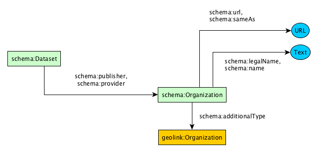
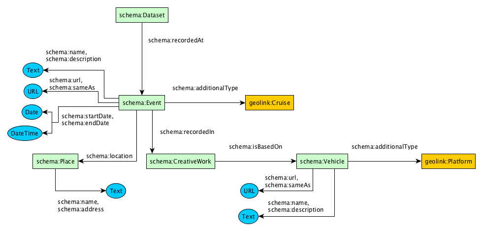
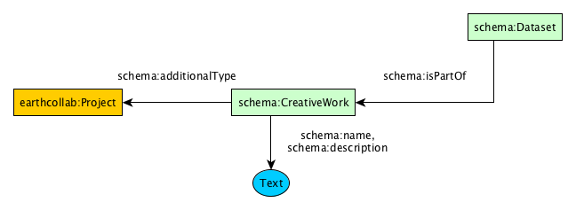

* [About](#about)
* [Goals](#goals)
* [Approach](#approach)
* [Vocabulary Prefixes](#prefixes)
* [Graphical Notation](#graphical-notation)
* [Publishing schema.org JSON-LD](#schemaorg-jsonld)
  * [Describing a Repository](#repository)
    * [Repository - Fields](#repository-fields)
    * [Repository - Provider](#repository-provider)
      * [Repository - Provider - Identifier](#repository-provider-identifier)
    * [Repository - Services](#repository-services)
    * [Repository - Offer Catalog](#repository-offercatalog)
  * [Dataset](#dataset-diagram)
    * [Variables](#dataset-variables)
    * [Spatial](#dataset-spatial)
    * [Temporal](#dataset-temporal)
    * [Identifiers](#dataset-identifiers)
    * [Creators/Contributors](#dataset-creator_contributor)
    * [Publisher/Provider](#dataset-publisher_provider)
    * [Distributions](#dataset-distros)
    * [Protocols](#dataset-protocols)
    * [Funding](#dataset-funding)
    * [Deployment]($dataset-deployment)
    * [Project](#dataset-project)
    * [DataCatalog](#dataset-catalog)
* [Examples](#examples)
* [Issues](#issues)

## About

Serves the vocabulary in JSON-LD at https://geodex.org/voc/.

## Goals

1) To produce quality schema.org markup with additional extensions to schema.org classes to help improve harvesting technologies.

2) Produced markup will pass the [Google Structured Data Testing Tool](https://search.google.com/structured-data/testing-tool/u/0/) with 0 errors.

## Approach

The preferred format for schema.org markup by its harvesters is JSON-LD. For a primer on JSON-LD, see [https://json-ld.org/](https://json-ld.org/)

To produce quality schema.org, all extensions to schema.org classes will be made through the use of the recommended property [schema:additionalType](https://schema.org/additionalType).

The gdx: vocabulary will extend schema.org using rdfs:subClassOf in it's formal ontology, but in schema.org this doesn't translate into the use of JSON-LD's [@type](https://www.w3.org/TR/json-ld/#syntax-tokens-and-keywords) as traditional RDF publishing would encourage.

## Vocabulary Prefixes

| Prefix        | Vocabulary URI |
| ------------- |----------------|
| schema:       | [<https://schema.org/>](https://schema.org/) |
| gdx:          | [<https://geodex.org/voc/>](https://geodex.org/voc/) |
| earthcollab:  | [<https://library.ucar.edu/earthcollab/schema#>](https://library.ucar.edu/earthcollab/schema#) |
| geolink:      | [<http://schema.geolink.org/1.0/base/main#>](http://schema.geolink.org/1.0/base/main#) |
| vivo:         | [<http://vivoweb.org/ontology/core#>](http://vivoweb.org/ontology/core#) |
| geo-upper:    | [<http://www.geoscienceontology.org/geo-upper#>](http://www.geoscienceontology.org/geo-upper#) |
| datacite      | [<http://purl.org/spar/datacite/>](http://purl.org/spar/datacite/) |
| dbpedia:      | [<http://dbpedia.org/resource/>](http://dbpedia.org/resource/) |

[schema:](https://schema.org/) the defacto vocabulary for publishing structured data in web pages for search engine harvesting

[gdx:](https://geodex.org/voc/) the P418 project's vocabulary

[earthcollab:](https://library.ucar.edu/earthcollab/schema#) an EarthCube Building Block focusing on extensions to the ViVO ontology

[vivo:](http://vivoweb.org/ontology/core#) the ViVO ontology

[geo-upper:](http://www.geoscienceontology.org/geo-upper#) a segment of the Geoscience Standard Names Ontology, an EarthCube product

[datacite:](http://purl.org/spar/datacite/) describes persistent identifier schemes like DOI, ARK, URI for helping to represent PIDs. 

[dbpedia:](http://dbpedia.org/resource/) Structured data for Wikipedia resources

## Graphical Notation

The graphs display the classes, properties and literals for producing valid schema.org markup.

Back to [top](#top)

## Schema.org JSON-LD

Schema.org's preferred format for markup is JSON-LD.....describe tools that help publish schema.org

## Describing a Repository

This vocabulary has split apart the *function* of the repository from the organization(s) that operate/provide those functions. In schema.org, this *function* is best described as a [schema:Service](https://schema.org/Service). This service is [provided](https://schema.org/provider) by one or many [Organizations](https://schema.org/Organization). At first, this may seem strange, but if you think about the homepage of many repositories they describe the ways, or service channels, a user can interact with at that repository - finding data, submitting data, etc. Often, these homepages link to an 'About' page that describes the team and organizations providing the service of the repository. We recognize the value of this distiction between the service a repository provides to a community and the organization(s) that provide that service. Becuase the Service class in schema.org is very broad, to uniquely identify repositories curating research products, this vocabulary defines an extension to [schema:Service](https://schema.org/Service) as [gdx:ResearchRepositoryService](https://geodex.org/voc/ResearchRepositoryService).

<pre>
{
  "@context": {
    "@vocab": "http://schema.org/",
    "gdx": "https://geodex.org/voc/"
  },
  <strong>"@type": "Service",
  "additionalType": "gdx:ResearchRepositoryService"</strong>,
  "name": "Sample Data Repository Service"
  </strong>
}
</pre>

This service will descrine to 3 main items - 1) the [Organization](#repository-provider) providing the service, 2) the services available for interacting with the repository (searching the repository and submitting resources, etc), and 3) the catalog of resources curated by the repository. But, it also has other fields that you can to describe a repository

* [schema:url](https://schema.org/url) should be the url of your repository's homepage, 
* [schema:description](https://schema.org/description) should be text describing your repository, 
* [schema:category](https://schema.org/category)  can be used to describe the discipline, domain, area of study that encompasses the repository's holdings. 

<pre>
{
  "@context": {
    "@vocab": "http://schema.org/",
    "gdx": "https://geodex.org/voc/"
  },
  "@type": "Service",
  "additionalType": "gdx:ResearchRepositoryService",
  "name": "Sample Data Repository Service",
  <strong>"url": "https://www.sample-data-repository.org",
  "description": "The Sample Data Repository Service provides access to data from an imaginary domain accessible from this website....",
  "category": [
    "Biological Oceanography",
    "Chemical Oceanography"
  ]
  </strong>
}
</pre>

(See [advanced publishing techniques](#advanced-publishing) for how to [describe categories/disciplines in more detail](#advanced-publishing-category) than just simple text.)

### Describing a Repository's Provider(s)

The [schema:provider](https://schema.org/provider) field of schema:Service can then be used to describe the [schema:Organization](https://schema.org/Organization).
<pre>
{
  "@context": {
    "@vocab": "http://schema.org/",
    "gdx": "https://geodex.org/voc/"
  },
  "@type": "Service",
  "additionalType": "gdx:ResearchRepositoryService",
  "name": "Sample Data Repository Service",
  "url": "https://www.sample-data-repository.org",
  "description": "The Sample Data Repository Service provides access to data from an imaginary domain accessible from this website....",
  "category": [
    "Biological Oceanography",
    "Chemical Oceanography"
  ],
  <strong>"provider": {
    "@type": "Organization",
    "legalName": "Sample Data Repository Office"
  }</strong>
}
</pre>

### Describing a Repository's Provider Identifier

#repository-provider-identifier
Some organizations may have a persistent identifier (DOI) assigned to their organization from authorities like the Registry of Research Data Repositories (re3data.org). The way to describe these organizational identifiers is to use the [schema:identifier](https://schema.org/identifier) property in this way:

<pre>
{
  "@context": {
    "@vocab": "http://schema.org/",
    "gdx": "https://geodex.org/voc/",
    <strong>"datacite": "http://purl.org/spar/datacite/"</strong>
  },
  "@type": "Service",
  "additionalType": "gdx:ResearchRepositoryService",
  "name": "Sample Data Repository Service",
  "description": "The Sample Data Repository Service provides access to data from an imaginary domain accessible from this website....",
  "url": "https://www.sample-data-repository.org",
  "category": [
    "Biological Oceanography",
    "Chemical Oceanography"
  ],
  "provider": {
    "@type": "Organization",
    "legalName": "Sample Data Repository Office",
    <strong>"identifier": {
      "@type": "PropertyValue",
      "propertyID": "datacite:doi",
      "value": "10.17616/R37P4C",
      "url": "http://doi.org/10.17616/R37P4C"
    }</strong>
  }
}
</pre>

We add the `datacite` vocabulary to the `@context` because the Datacite Ontology available at [http://purl.org/spar/datacite/](http://purl.org/spar/datacite/) has URIs to describe a DOI, ORCiD, ARK, URI, URN - all identifier scheme that help for disamiguating identifiers. To properly disambiguate a globally unique identifier, 2 pieces of information are needed - 1) the identifier value and 2) the scheme that on which that identifier exists. Some examples of this concept for common identifiers  are:

| Scheme | Value |
| ------ | ----- |
| DOI    | 10.17616/R37P4C |
| ORCiD  | 0000-0002-6059-4651 |

When describing PIDs, it's important to include both of these pieces for downstream activities like searching and linking resources. FOor example, a user may want to query for all repositories with a DOI identifier or all Datasets authored by a researcher with an ORCiD. These types of filters become more difficult when only the URL to these identifiers are provided. The reason here is that there are multiple URLs for an persistent identifier. On example is the DOI:

http://doi.org/10.17616/R37P4C
https://doi.org/10.17616/R37P4C
http://dx.doi.org/10.17616/R37P4C
https://dx.doi.org/10.17616/R37P4C

So, the best practice is to provide the scheme and value for an identifier, but you can also provide a URL representation using the [schema:url](https://schema.org/url) property.

### Describing a Repository's Services

### Describing a Repository's Offer Catalog

Back to [top](#top)

### Dataset

#### Variables

#### Spatial

#### Temporal

#### Identifiers

#### Creators/Contributors

#### Publisher/Provider

#### Distributions

#### Protocols

#### Funding

#### Deployment

#### Project

#### DataCatalog

Back to [top](#top)

### Examples

All examples can be found at: https://github.com/earthcubearchitecture-project418/p418Vocabulary/tree/master/html/voc/static/schema/examples/

Repository Examples: https://github.com/earthcubearchitecture-project418/p418Vocabulary/tree/master/html/voc/static/schema/examples/repository

Dataset Examples: https://github.com/earthcubearchitecture-project418/p418Vocabulary/tree/master/html/voc/static/schema/examples/resource

#### Issues

https://stackoverflow.com/questions/38243521/schema-org-contacttype-validation-issue-the-value-provided-for-office-must-be

### Advanced Publishing Techniques

#### How to publish resources for the categories/disciplines at repository services.

The SWEET ontology defines a number of science disciplines and a repository could reference those, or another vocabuary's resources, by adding the vocabular to the `@context` attribute of the JSON-LD markup. 

<pre>
{
  "@context": {
    "@vocab": "http://schema.org/",
    "gdx": "https://geodex.org/voc/",
    "sweet-rel": "http://sweetontology.net/rela/",
    "sweet-kd": "http://sweetontology.net/humanKnowledgeDomain/"
  },
  "@type": "Service",
  "additionalType": "gdx:ResearchRepositoryService",
  "provider": {
      "@type": "Organization",
      "legalName": "Sample Data Repository Office"
  },
  "name": "Sample Data Repository Service",
  "description": "The Sample Data Repository Service provides access to data from an imaginary domain accessible from this website....",
  "url": "https://www.sample-data-repository.org",
  <strong>"sweet-rel:hasRealm": [
    { "@id": "sweet-kd:Biogeochemistry" },
    { "@id": "sweet-kd:Oceanography" }
  ]
  </strong>
}
</pre>

Back to [top](#top)
